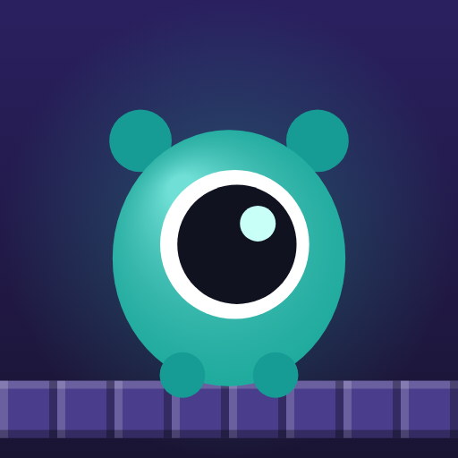
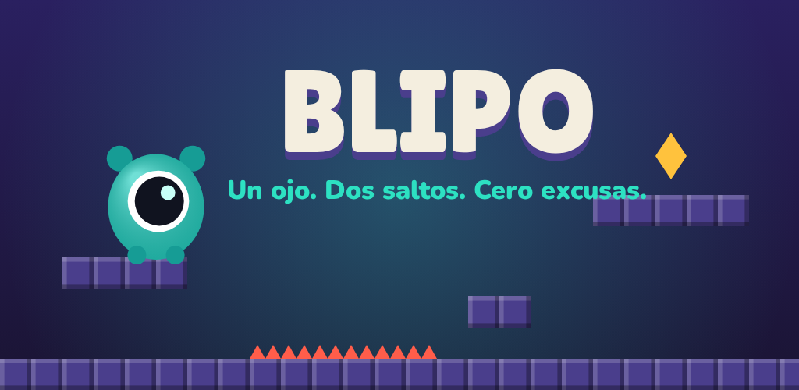

<div align="center">



# BLIPO

### Un ojo. Dos saltos. Cero excusas.

[](https://blipo.elmundodemanu.com)

<a href="https://blipo.elmundodemanu.com">
  
</a>

[](#-licencia)


<br/>



</div>

<br/>

## ¿Qué es BLIPO?

**BLIPO** es un cíclope-gota turquesa con un único ojo enorme, protagonista de un juego de **plataformas de precisión** pensado para partidas cortas: muertes instantáneas sin castigo y esa sensación de *"una más"* que no te deja soltar el mando.

Corre en el navegador, se instala como **PWA**, funciona **offline** y se empaqueta como app nativa de Android con **Capacitor**. Todo construido desde cero, sin frameworks: HTML + CSS + JavaScript (ES Modules) puro sobre Canvas 2D.

> 🎮 **Pruébalo en producción:** **[blipo.elmundodemanu.com](https://blipo.elmundodemanu.com)**

<div align="center">

| 🕹️ Precisión | 🌍 5 mundos | 📅 Reto diario | ♾️ Supervivencia | 🎨 9 skins |
|:---:|:---:|:---:|:---:|:---:|
| Doble salto | 52 niveles | Racha 🔥 | 5 vidas | Chispas |

</div>

---

## 📑 Índice

- [Características](#-características)
- [Cómo correrlo en local](#-cómo-correrlo-en-local)
- [Controles](#-controles)
- [Mundos](#-mundos)
- [Identidad visual](#-identidad-visual)
- [Arquitectura del proyecto](#-arquitectura-del-proyecto)
- [Publicación](#-publicación)
- [Créditos](#-créditos)
- [Licencia](#-licencia)

---

## ✨ Características

<table>
<tr>
<td width="50%" valign="top">

**🧩 Contenido**
- 52 niveles en 5 mundos: 42 diseñados a mano (Cantera, Cavernas, Fundición y Glaciar) + 10 generados con semilla fija
- Cavernas con mecánicas propias: hongos saltarines, telarañas que frenan la caída y cuevas oscuras con cristales que iluminan
- Fundición con mecánicas propias: cintas transportadoras, llamaradas con ritmo y plataformas móviles
- Glaciar con mecánicas propias: hielo resbaloso, carámbanos que caen, viento lateral, ráfagas y corrientes que elevan
- Mapas de tamaño libre (anchos y altos) con cámara que sigue a Blipo y fondos con paralaje por mundo
- Reto diario: mismo nivel para todos, racha 🔥, premio creciente y botón para compartir
- Supervivencia: salas infinitas cada vez más difíciles, 5 vidas
- 17 logros y estadísticas de progreso

</td>
<td width="50%" valign="top">

**⚙️ Producto**
- Economía de chispas y 9 skins jugables
- ES / EN, alto contraste, reducir efectos
- Controles táctiles configurables + soporte de mando
- Instalación PWA y juego 100% offline

</td>
</tr>
</table>

---

## 🚀 Cómo correrlo en local

Los ES Modules **no funcionan** abriendo `index.html` con doble clic (`file://`). Hay que servirlo por HTTP:

```bash
# Opción A — Live Server (VS Code)
# clic derecho sobre index.html → "Open with Live Server"

# Opción B — servidor local
npm run dev
# abre http://localhost:5173
```

> ℹ️ El service worker (modo offline) se desactiva en `localhost` para no interferir mientras desarrollas. Para probarlo en local agrega `?sw=1` a la URL.

<details>
<summary><strong>📦 Compilar y empaquetar para Android (Capacitor)</strong></summary>

```bash
npm run build:web   # genera el build web optimizado
npm run cap:init    # agrega la plataforma Android (una sola vez)
npm run cap:sync    # sincroniza el build con el proyecto nativo
npm run cap:open    # abre el proyecto en Android Studio
```

</details>

---

## 🎮 Controles

| Acción | Teclado | Mando | Táctil |
|---|---|---|---|
| Mover | ← → / A D | Stick / cruceta | Flechas abajo-izquierda |
| Saltar / doble salto | ↑ W Espacio Z K | A / X / Y | Botón grande |
| Pausa | Esc / P | Start | Botón ⏸ |
| Reiniciar | R | Select | Desde la pausa |

---

## 🌍 Mundos

| Mundo | Tono | Estrellas para abrir |
|---|---|:---:|
| 🪨 Cantera | Azul piedra | 0 |
| 🌿 Cavernas | Verde musgo · hongos, telarañas y oscuridad | 10 |
| 🔥 Fundición | Naranja óxido · cintas, llamaradas y plataformas móviles | 35 |
| ❄️ Glaciar | Celeste hielo · hielo resbaloso, carámbanos y viento | 65 |
| 🌌 Vacío | Violeta | 95 |

---

## 🎨 Identidad visual

<div align="center">

| Tinta | Piedra Violeta | Turquesa | Coral Lava | Oro Chispa | Hueso |
|:---:|:---:|:---:|:---:|:---:|:---:|
|  |  |  |  |  |  |
| `#1A1433` | `#4A3E8C` | `#2DE1C2` | `#FF5D4A` | `#FFC23D` | `#F4EEDF` |

</div>

- **Tipografía:** [Lilita One](assets/fonts) para títulos y logo, **Nunito** para interfaz y textos (incluidas localmente, licencia SIL OFL).
- **Elemento memorable:** todos los botones tienen *bisel de piedra* — se ven como los bloques del nivel y se "hunden" al presionarlos.

📖 Detalle completo en [`docs/IDENTIDAD.md`](docs/IDENTIDAD.md).

---

## 🏗️ Arquitectura del proyecto

```
blipo/
├─ index.html            # Punto de entrada
├─ manifest.webmanifest  # Configuración PWA
├─ sw.js                 # Service worker (offline)
├─ capacitor.config.json # Empaquetado Android
├─ css/                  # Tokens, componentes, pantallas, responsive
├─ js/
│  ├─ core/   engine/   entities/   systems/
│  ├─ game/   levels/   ui/   i18n/   app/
│  └─ main.js
├─ assets/               # Iconos, fuentes, arte de tienda
├─ tools/                # brand.html, build-web.mjs
└─ docs/                 # Arquitectura, identidad, publicación
```

📖 Mapa completo del código en [`docs/ARQUITECTURA.md`](docs/ARQUITECTURA.md).

**Para regenerar íconos:** abre `tools/brand.html` con Live Server y descarga cada imagen — usa el mismo código que dibuja al personaje dentro del juego.

---

## 📱 Publicación

BLIPO está publicado y disponible para jugar en:

<div align="center">

### 🔗 [blipo.elmundodemanu.com](https://blipo.elmundodemanu.com)

</div>

Instalable como PWA en cualquier dispositivo (Android, iOS, escritorio) y preparado para publicarse en **Play Store** vía Capacitor. Guía completa en [`docs/PLAY_STORE.md`](docs/PLAY_STORE.md).

---

## 👤 Créditos

<div align="center">

Creado con 💜 por **Carlos Manuel Turizo Hernández**
**El Mundo de Manu**

[](https://blipo.elmundodemanu.com)

</div>

## 📄 Licencia

Proyecto privado — todos los derechos reservados © Carlos Manuel Turizo Hernández.

<div align="center">
<sub>Un ojo. Dos saltos. Cero excusas. 👁️</sub>
</div>
</content>
